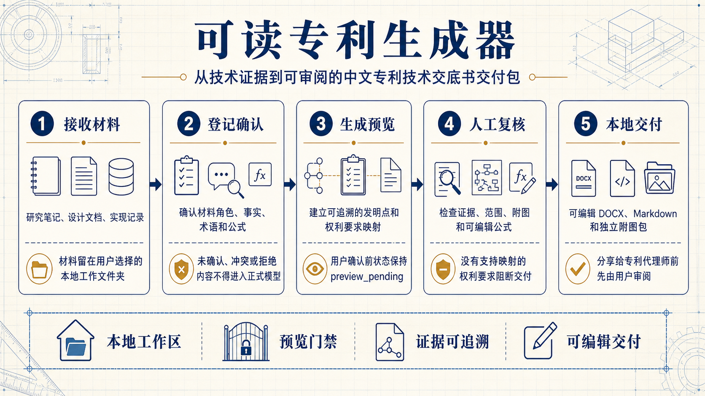
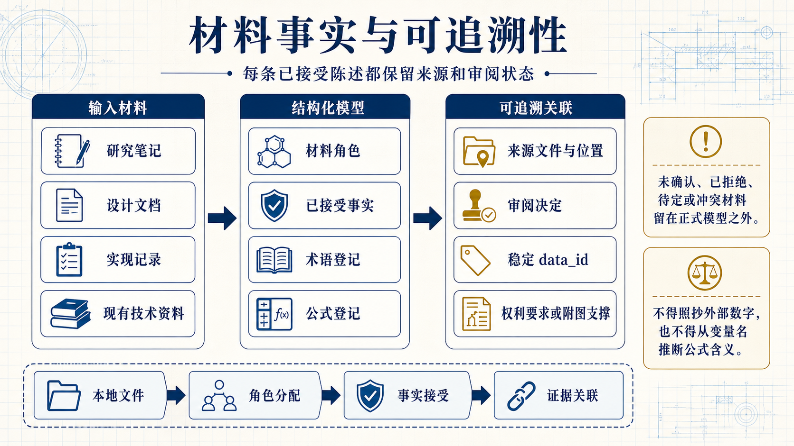
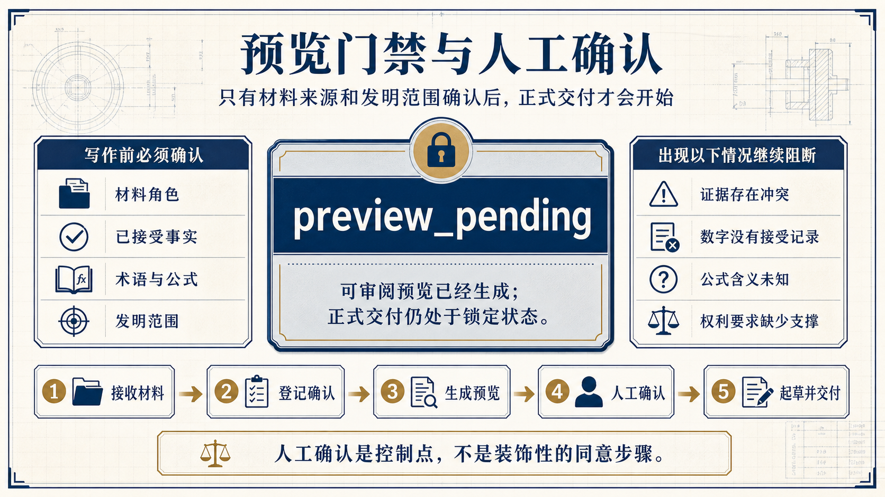
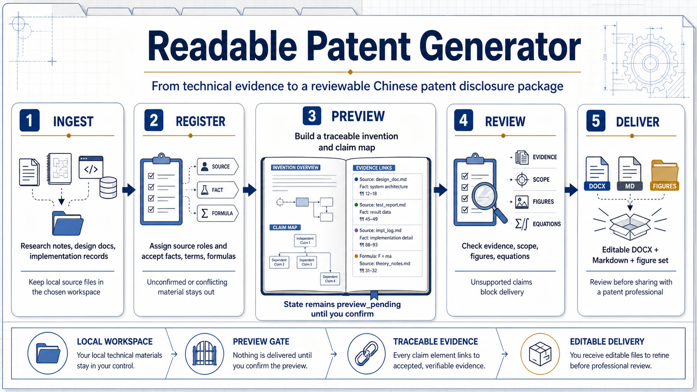

<p align="center">
  <a href="README.md">English</a>
  <span>&nbsp;|&nbsp;</span>
  <a href="README-CN.md"><strong>中文</strong></a>
</p>

<h1 align="center">Readable Patent Generator</h1>

<p align="center">
  
</p>

<p align="center">
  <a href="LICENSE"></a>
  <a href="pyproject.toml"></a>
  
  <a href="SKILL.md"></a>
  <a href="references/README.md"></a>
</p>

<p align="center">
  面向 Codex 的技能，把技术材料整理成可审阅的中文专利技术交底书交付包。
</p>

Readable Patent Generator 面向科研人员、工程师和专利撰写协作者，把研究笔记、设计文档、实现记录及其他技术材料整理成清晰的中文专利技术交底书。它会把原始材料、草稿、权利要求、公式和附图保持关联，方便你与专利代理师一起审阅。整个流程坚持本地化和先审阅后交付：材料角色必须先确认，已接受事实保留来源关联，没有支撑的权利要求特征会阻断交付。

## 它可以帮你做什么

- 把技术材料整理成连贯的发明说明。
- 区分发明依据与现有技术材料。
- 在写作前检查关键事实、术语、公式和权利要求范围。
- 生成可编辑的 DOCX 文档、Markdown 草稿和独立附图包。
- 先生成预览，让你在正式交付前修正方向。

## 安装技能

告诉你的 AI 助手从公开仓库安装这个技能：

```text
请从 https://github.com/Eriemon/patent-generator 安装 readable-patent-generator 技能。
```

技能可用后，就可以直接在你的 AI 助手中使用它。

## 使用方法

### 1. 准备材料

把希望 AI 助手审阅的材料放在你选择的工作文件夹中。可以包括研究笔记、设计文档、实现记录、实验说明、附图以及相关现有技术资料。



这张图把输入材料、结构化模型和来源支撑关联分开显示。数字、阈值、样本数或公式不会因为出现在材料中就自动成为事实；它们必须经过接受确认，绑定稳定标识，并回到具体来源位置。

### 2. 请求生成专利技术交底书

直接说出技能名称和你希望得到的结果。例如：

```text
请使用 $readable-patent-generator，把这个文件夹中的材料整理成中文专利技术交底书交付包。先生成预览，并在正式写作前让我确认材料用途、关键事实和发明范围。
```

### 3. 审阅预览

AI 助手会展示材料、技术术语、关键事实、公式、权利要求和附图之间的关系。凡是会影响发明内容的地方，都应先确认或修正，再请求正式交付。



预览是一个真正的控制点。正式写作前，需要确认材料角色、已接受事实、术语、公式含义和发明范围。若来源支撑冲突、数字没有接受记录、公式含义不明确，或权利要求缺少支撑，流程会继续保持阻断。

### 4. 获取交付包

你确认预览后，AI 助手会准备正式交付包：

- 以中文专利技术交底书为核心的主交付物。
- 便于审阅和交接的可编辑 DOCX 版本。
- 便于持续修改和追溯的 Markdown 版本。
- 与交底书配套的独立附图包。


支撑映射用于审阅，而不是让人把生成结果当成黑盒结论。定量陈述要绑定已接受的稳定 data_id；独立权利要求特征要关联当前人工复核的支撑；公式保持可编辑；附图的图注、编号和来源绑定贯穿交付过程。

## 使用时请注意

本技能负责整理和起草技术交底材料，不能替代专利代理师的法律审阅或申请决策。涉密材料请放在你信任的工作环境中，并在分享前审阅生成的交付包。



最终得到的是留在本地、可编辑的交付包：DOCX 交底书、已确认的 Markdown 源稿、独立附图包以及权利要求/支撑映射。哪些内容离开工作区、何时交给专利代理师，由用户自行决定；本技能不替代法律审阅或申请决策。

## 作者与引用

Jiyuan Liu 和 He Li 来自东南大学（Southeast University）。本项目与 Heterogeneous Intelligence and Quantum Computing Laboratory (HIQC) 共同开发。

如果你的工作使用了本技能，请通过 [CITATION.cff](CITATION.cff) 引用：

```bibtex
@software{liu_2026_readable_patent_generator,
  author = {Jiyuan Liu and He Li},
  title = {{Readable Patent Generator}: A Governed Local Skill for Chinese Patent Packages},
  year = {2026},
  version = {2.1.6},
  date = {2026-08-12},
  url = {https://github.com/Eriemon/patent-generator},
  license = {Apache-2.0}
}
```

本技能采用 Apache License 2.0。请阅读 [LICENSE](LICENSE)、[CONTRIBUTING.md](CONTRIBUTING.md)、[SECURITY.md](SECURITY.md) 和 [CITATION.cff](CITATION.cff)。

发布日期：2026-08-12 · 版本：v2.1.6
