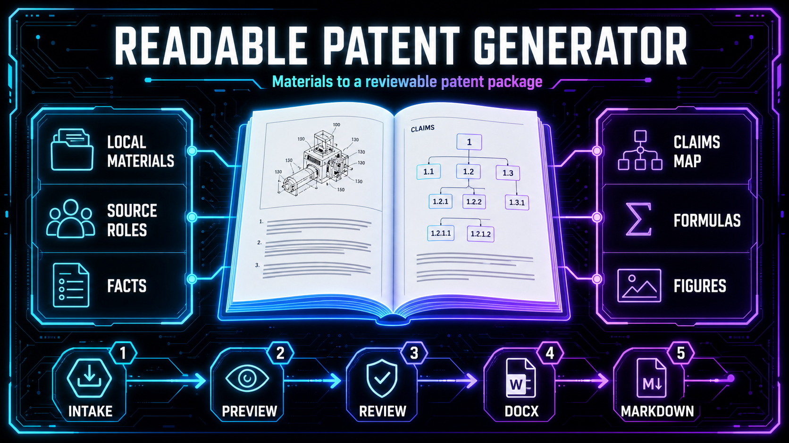
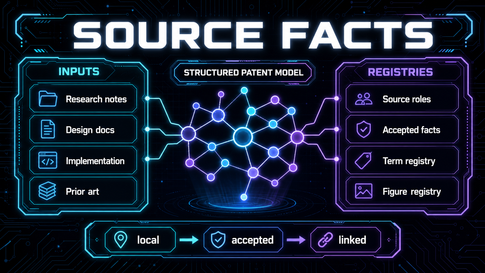
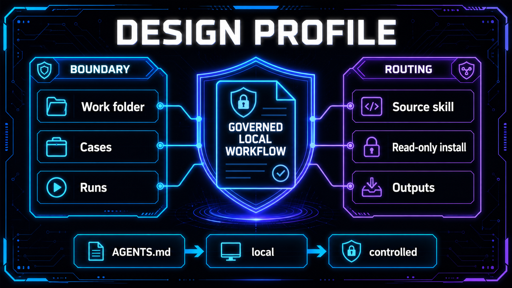
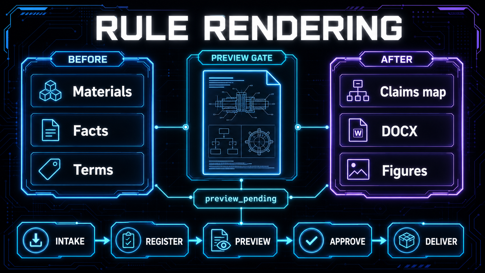
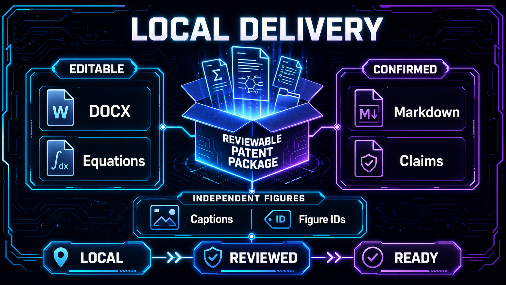

<p align="center">
  <a href="README.md"><strong>English</strong></a>
  <span>&nbsp;|&nbsp;</span>
  <a href="README-CN.md">中文</a>
</p>

<h1 align="center">Readable Patent Generator</h1>

<p align="center">
  
</p>

<p align="center">
  <a href="LICENSE"></a>
  <a href="pyproject.toml"></a>
  
  <a href="SKILL.md"></a>
  <a href="references/README.md"></a>
</p>

<p align="center">
  A Codex-ready skill for turning local technical material into a reviewable Chinese patent package.
</p>

<p align="center">
  Latest release: <strong>v2.1.4</strong> · Released on <strong>2026-08-12</strong>
</p>

Readable Patent Generator turns local research material, design notes, implementation records, and confirmed patent experience into a reviewable Chinese patent technical-disclosure package. It keeps the source material, structured facts, editable equations, claims map, Markdown draft, DOCX template output, and independent figures connected throughout the workflow.

## Why teams use it

The skill is designed for researchers, engineers, and patent-writing collaborators who need a repeatable local workflow rather than a one-off draft. The package is preview-first, source-role aware, and explicit about every accepted numeric fact, term, formula, and figure.

## 01 — Start from local material

The first capability is a clear path from local materials to a patent package: inventory the inputs, assign an invention-source or prior-art role, register accepted facts, and only then compose the disclosure model 4.0 and claims map 3.0.



## 02 — Keep facts and scope aligned

The skill follows the current work-folder `AGENTS.md`, keeps installed skill files read-only, and routes cases and outputs to the selected local research root. Formula semantics come from `formula_facts.json` and `formula_registry`; quantitative claims remain attached to stable `data_id` values.



## 03 — Carry the preview through delivery

Every case starts at `preview_pending`. The preview brings together the accepted materials, terminology, facts, formulas, claim features, and figure registry. Formal DOCX/Markdown delivery begins only after the explicit preview gate is satisfied.



## Local delivery package

The final package combines an editable DOCX template, confirmed Markdown, and an independent figure set. Structural, language, delivery, and agent-behavior evaluations must be clear before the package is reported as ready.



## Get started

Use the skill from the current local work folder with `$readable-patent-generator`. The registry is the canonical entry point for commands and document governance:

```powershell
python -B scripts/python/registry/build_registry.py --json
python -B scripts/python/registry/query_registry.py "registry" --kind command --json
python -B scripts/python/registry/manage_document_registry.py status --json
```

Read [SKILL.md](SKILL.md) for the operating contract and [references/README.md](references/README.md) for the end-to-end workflow. Keep runtime cases, source materials, and generated outputs in the current local work folder or an explicitly selected research root.

## Develop locally, mirror deliberately

The source skill directory is the only place where README and workflow changes are authored. A versioned dist package is created from that source, and an existing `github/` checkout receives only the completed package. Local development, installation, and remote publication remain separate decisions.

```powershell
python path/to/agents-md-generator/scripts/python/release/github_skill_release.py status --project . --skill-dir skills/readable-patent-generator
python path/to/agents-md-generator/scripts/python/release/github_skill_release.py check --project . --skill-dir skills/readable-patent-generator
```

The mirror keeps `.git`, replaces the checkout content with the selected dist package, compares the resulting files, and never creates a remote repository or runs `commit`, `push`, `tag`, or GitHub Release actions for you.

## What ships in the skill

| Capability | Maintainer outcome |
| --- | --- |
| Material intake | A local source map with explicit roles |
| Structured drafting | Facts, terms, formulas, claims, and figures stay linked |
| Preview gate | Formal output starts only after preview confirmation |
| Editable delivery | DOCX, Markdown, and independent figures travel together |

## Authors and citation

Jiyuan Liu and He Li are with Southeast University (东南大学). The work is developed with the Heterogeneous Intelligence and Quantum Computing Laboratory (HIQC).

If you build on this skill, cite the package through [CITATION.cff](CITATION.cff):

```bibtex
@software{liu_2026_readable_patent_generator,
  author = {Jiyuan Liu and He Li},
  title = {{Readable Patent Generator}: A Governed Local Skill for Chinese Patent Packages},
  year = {2026},
  version = {2.1.4},
  date = {2026-08-12},
  url = {https://github.com/Eriemon/patent-generator},
  license = {Apache-2.0}
}
```

Released under the Apache License 2.0. See [LICENSE](LICENSE), [CONTRIBUTING.md](CONTRIBUTING.md), [SECURITY.md](SECURITY.md), and [CITATION.cff](CITATION.cff).

Release date: 2026-08-12 · Version: v2.1.4
